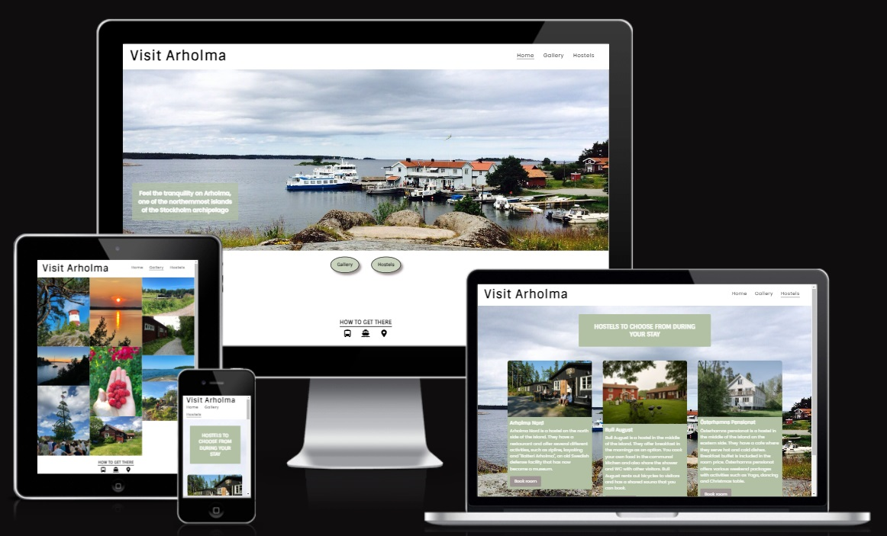

# Arholma

[The actual website](https://merin86.github.io/arholma/)

Arholma is an island in Stockholm archipelago. This website provides brief information about the island, pictures in a gallery that shows what the island has to offer and a page listing hostels to choose from. The website's target group is tourists who want to experience the archipelago in Stockholm.

## Contents

## Features

## Testing

## Deployment

## Credits

Pictures
* Arholma Nord: (https://www.tripadvisor.se/)
* Bull August: (https://trippa.se/)
* Österhamns pensionat: (https://www.roslagen.se/)

