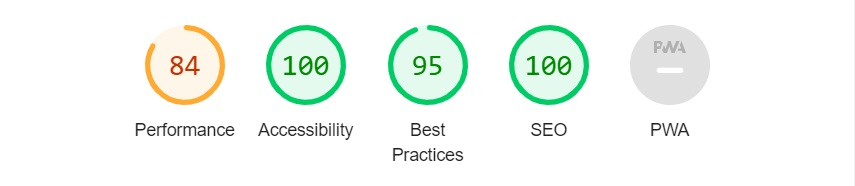
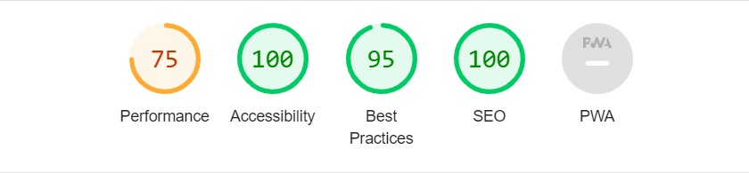

# Arholma

[The actual website](https://merin86.github.io/arholma/)

Arholma is an island in Stockholm archipelago. This website provides brief information about the island, how to get there, pictures in a gallery that shows what the island has to offer and a page listing hostels to choose from. The website's target group is tourists who want to experience the archipelago in Stockholm.

## Content index

* [User Experience (UX)](#user-experience-ux)
* [Features](#features)
* [Design](#design)
* [Technologies Used](#technologies-used)
* [Testing](#testing)
* [Deployment](#deployment)
* [Credits](#credits)

## User Experience (UX)

- ### User stories

    -   #### A. First Time Visitor Goals

        1. As a first time visitor, I want to understand the purpose of the homepage and be motivated to visit the island.
        2. As a first-time visitor, I want to be able to easily understand how to find the content I'm looking for on the website.
        3. As a first-time visitor, I want it to be easy to find out how to get there and where to stay.

    -   #### B. Returning Visitor Goals
        1. As a Returning Visitor, I want it to be quick and easy to find the links on how to get to the island.
        2. As a Returning Visitor, I want it to be quick and easy to find the links for how to book rooms on the island.

    -   #### C. Frequent User Goals
        1. As a Frequent User, I want to use the site as a starting point for when I book rooms at the island's various hostels.

## Features

-   Navigation

    - In the upper left corner, the logo "Visit Arholma" is displayed, which is a link to the front page of the website.
    - In the upper right corner, are the links to the other pages of the website: "Home", Gallery" and "Hostels".
    - The navigation bar is included on all three pages and is also responsive depending on the screen size. On mobile phones, the links to the various pages are located below the logo.

    

-   Front Page

    - The front page consists of the "hero" image with a strip of text that together wants to give the impression of calm and harmony on the island and a text box with information about the island. The color theme is matte, which also generates a calm impression for the user.
    - The two buttons, placed directly below the text, create clarity for the user about what the website has to offer.

    

    

- Footer

    - The Footer is visible on all pages and always looks the same to be user-friendly. It consists of a text: "How to get there", with three icons underneath. The first icon is a bus, a link that takes you to SL.se where you can search for bus tours. The second icon is a boat, a link to Waxholmsbolaget where you can search for boat trips. The third is a location dot, a link to Google Maps where you can plan your journey by yourself.

    

- Gallery

    - The gallery gives the user an idea of what the island looks like and what it has to offer.

    

- Hostels

    - The hostel page gives a brief summary of what the three different hostels to choose from have to offer. To clarify the content for the user, the hostels have been divided into three panels. The hostels to choose from are: "Arholma Nord", "Bull August" and "Österhamns pensionat".
    - The page uses a consistent look and feel by using the same background image used for the front page, with the exception of smaller screens (mobile phones) as the image was too stretched in this format. The same background colour was applied to the panels as used on the main page text strip for cohesion.

    

## Design

-   Wireframe

    - Wireframe used as a starting point for the design of the website.

- Colour
    - The main color used in the project can be seen below. It is a dull green color to give a calm and harmonious impression. In addition to this, only black and white have been used, as well as a grayer scale for shadows. On the hostel page, a light blue background was used on small screens.

    

- Typography

    - Google Fonts was used to import Poppins and Sintony fonts into styles.css. These were chosen as they work well together and are easy to read.

## Technologies Used

### Languages Used

-   [HTML5](https://en.wikipedia.org/wiki/HTML5)
-   [CSS3](https://en.wikipedia.org/wiki/Cascading_Style_Sheets)

### Frameworks, Libraries & Programs Used

-   [Google Fonts](https://fonts.google.com/)
-   [Font Awesome](https://fontawesome.com/)
-   GitPod
-   [GitHub](https://github.com/)
-   [TinyPNG](https://tinypng.com/)
-   [Balsamiq](https://balsamiq.com/)

## Testing

### Validator Testing

- HTML Validator
    - result for index.html
    

    - result for gallery.html
    

    - result for hostels.html
    

- CSS Validator
    - result for style.css
    

- Accessibility
    - Accessibility has reached 100%, on all pages, after testing through Lighthouse under DevTools.
    
    
    

### Unfixed Bugs

No unfixed bugs

## Deployment

- The site was deployed to GitHub pages. The steps to deploy are as follows:
    - In the GitHub repository, navigate to the Settings tab, then choose Pages from the left hand menu.
    - From the source section drop-down menu, select the Master Branch.
    - Once the master branch has been selected, the page will be automatically refreshed with a detailed ribbon display to indicate the successful deployment.
    - Any changes pushed to the master branch will take effect on the live project.

  The live link can be found here - [Visit Arholma](https://merin86.github.io/arholma/)

## Credits

### Content
- The content on the hostel page was obtained from the hostels' websites
- All other content was written by the developer

### Code
- The structure of the website is taken from the "Love Running" website. Some codes have been copied from there and then alternated to fit this website.
- The code structure for the hostel page came from information on this video: [Responsive CSS tutorial video](https://www.youtube.com/watch?v=9FNNkzPBFcE)
- This previous PP1 project has been used as a source of inspiration for the website, as well as to create this README.md: [THRIVE](https://elainebroche-dev.github.io/ms1-thrive/)
- Much of the code to create this website comes from this webpage: [W3Schools](https://www.w3schools.com/)

### Media
- The icons in the footer were taken from [Font Awesome](https://fontawesome.com/)
- The fonts used were imported from [Google Fonts](https://fonts.google.com/)
- All images are the developer's, with the exception of the images of the three hostels. These images were taken from the following websites:
    - [Arholma Nord](https://www.tripadvisor.se/)
    - [Bull August](https://trippa.se/)
    - [Österhamns pensionat](https://www.roslagen.se/)

