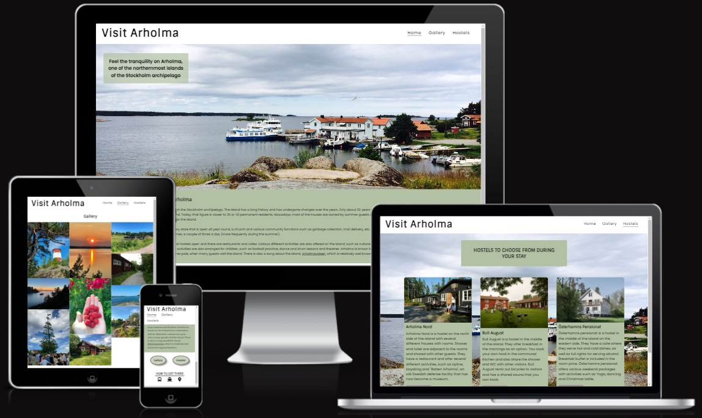
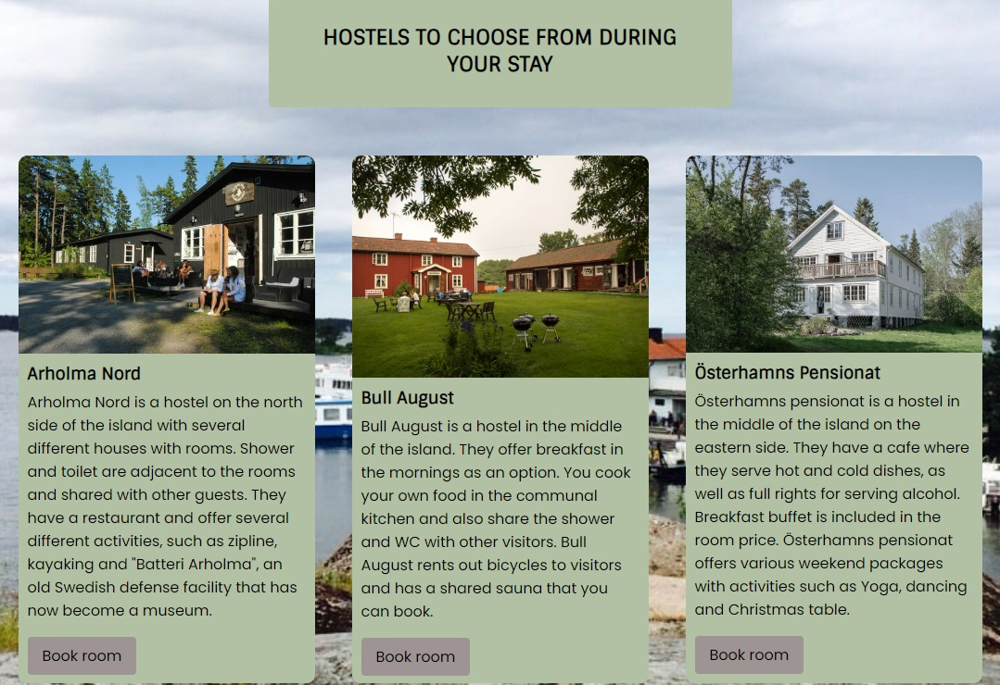

# Arholma

[The actual website](https://merin86.github.io/arholma/)

Arholma is an island in Stockholm archipelago. This website provides brief information about the island, how to get there, pictures in a gallery that shows what the island has to offer and a page listing hostels to choose from. The website's target group is tourists who want to experience the archipelago in Stockholm.

## Contents

## User Experience (UX)

- ### User stories

    -   #### A. First Time Visitor Goals

        1. As a first time visitor, I want to understand the purpose of the homepage and be motivated to explore further about the island.
        2. As a first-time visitor, I want to be able to easily understand how to find the content I'm looking for on the website.
        3. As a first-time visitor, I want it to be easy to find out how to get there and where to stay.

    -   #### B. Returning Visitor Goals
        1. As a Returning Visitor, I want it to be quick and easy to find the links on how to get to the island.
        2. As a Returning Visitor, I want it to be quick and easy to find the links for how to book rooms on the island.

    -   #### C. Frequent User Goals
        1. As a Frequent User, I want to use the site as a starting point for when I book rooms at the island's various hostels.

## Features

-   Navigation

    - In the upper left corner, the logo "Visit Arholma" is displayed, which is a link to the front page of the website.
    - In the upper right corner, are the links to the other pages of the website: "Home", Gallery" and "Hostels".
    - The navigation bar is included on all three pages and is also responsive depending on the screen size. On mobile phones, the links to the various pages are located below the logo.

    

-   Front Page

    - The front page mostly consists of the "hero" image with a strip of text that together wants to give the impression of calm and harmony on the island. The color theme is matte, which also generates a calm impression for the user.
    - The two buttons, placed directly below the image, create clarity for the user about what the website has to offer.

    

    

- Footer

    - The Footer is visible on all pages and always looks the same to be user-friendly. It consists of a text: "How to get there", with three icons underneath. The first icon is a bus, a link that takes you to SL.se where you can search for bus tours. The second icon is a boat, a link to Waxholmsbolaget where you can search for boat trips. The third is a location dot, a link to Google Maps where you can plan your journey by yourself.

    

- Gallery

    - The gallery gives the user an idea of what the island looks like and what it has to offer.

    

- Hostels

    - The hostel page gives a brief summary of what the three different hostels to choose from have to offer. To clarify the content for the user, the hostels have been divided into three panels. The hostels to choose from are: "Arholma Nord", "Bull August" and "Österhamns pensionat".
    - The page uses a consistent look and feel by using the same background image used for the front page, and by applying the same background color to the panels as used on the main page text strip.

    

## Design

-   Wireframe

    - Wireframe used as a starting point for the design of the website.

- Colour
    - The main color used in the project can be seen below. It is a dull green color to give a calm and harmonious impression. In addition to this, only black and white have been used, as well as a grayer scale for shadows.

    

- Typography

    - Google Fonts was used to import Poppins and Sintony fonts into styles.css. These were chosen as they work well together and are easy to read.

## Technologies Used

### Languages Used

-   [HTML5](https://en.wikipedia.org/wiki/HTML5)
-   [CSS3](https://en.wikipedia.org/wiki/Cascading_Style_Sheets)

### Frameworks, Libraries & Programs Used

-   [Google Fonts](https://fonts.google.com/)
-   [Font Awesome](https://fontawesome.com/)
-   GitPod
-   [GitHub](https://github.com/)
-   [TinyPNG](https://tinypng.com/)
-   [Balsamiq](https://balsamiq.com/)

## Testing

### Validator Testing

- HTML Validator
    - result for index.html
    

## Deployment

## Credits

Pictures
* Arholma Nord: (https://www.tripadvisor.se/)
* Bull August: (https://trippa.se/)
* Österhamns pensionat: (https://www.roslagen.se/)

